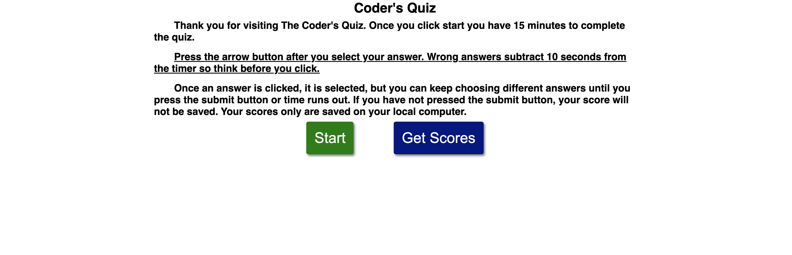
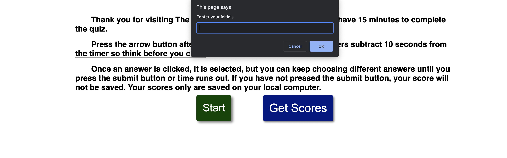
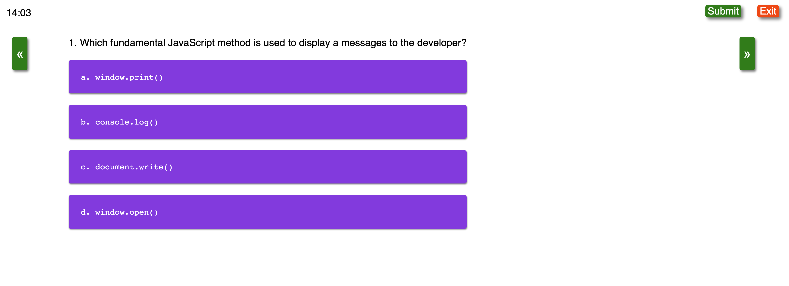
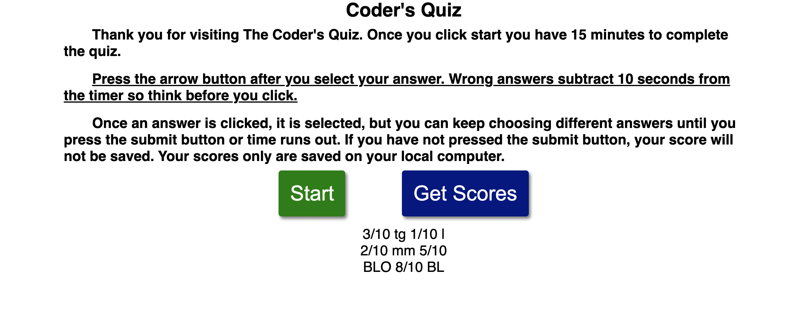

# API_codeQuiz

## Table of Contents
* Job Task
* GitHub Code
* Screenshot & Video
* Web Developer's Contact
## Job Task
The job task is to build a timed coding quiz with multiple-choice questions. The app will run in the browser and will feature dynamically updated HTML and CSS powered by JavaScript code.
* https://github.com/BrandonOkman/API_codeQuiz.git
## Screenshots and Video

## Web Developer's Contact

* GitHub:https://github.com/BrandonOkman
* Slack:https://app.slack.com/client/T02NZTSPT16/D02NU1HML0P/user_profile/U02P1V4EFGW
* Email: BOkmanwd@gmail.com